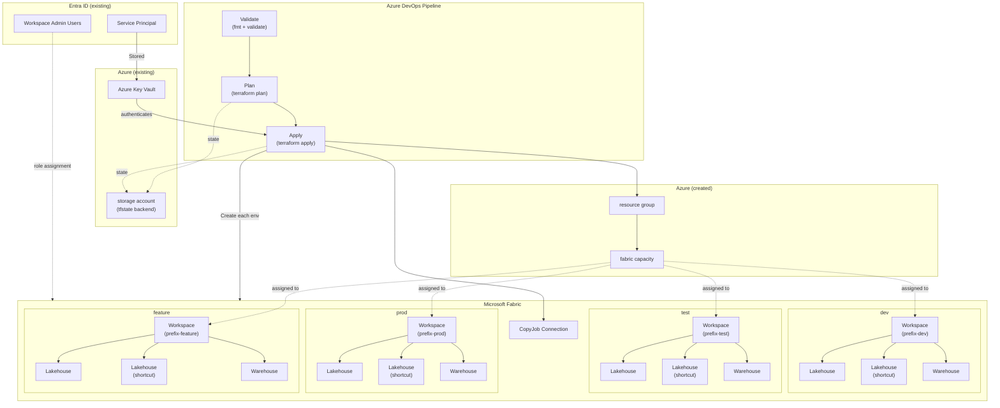

# Fabric CI/CD Lab — Terraform

Provisions the Azure + Microsoft Fabric resources needed to run a multi-environment (dev / test / prod) Fabric CI/CD lab.

## Architecture



## What it creates

Top-level (root module):

- **Azure Resource Group** — hosts the Fabric capacity (`azapi_resource.resource_group` in [azure.tf](azure.tf)).
- **Microsoft Fabric Capacity** — `Microsoft.Fabric/capacities` at the SKU set by `fabric_tier` (default `F2`). The SPN's enterprise-application object id plus any UPNs in `administrators` are set as capacity admins.
- **Lookup of `workspace_admins`** UPNs in Entra ID to resolve them to object ids.

Per environment (the `./workspace` module is invoked once per key in `local.environments` — `dev`, `test`, `prod` — see [workspace/workspace.tf](workspace/workspace.tf)):

- **Fabric Workspace** named `<workspace_name_prefix>-<env>` with a system-assigned workspace identity, bound to the capacity above.
- **Workspace admin role assignments** for every user in `workspace_admins`.
- **Two Fabric Lakehouses** (schemas enabled).
- **One Fabric Warehouse**.

## Outputs

All root outputs are maps keyed by environment (`dev` / `test` / `prod`):

- `workspace_ids`
- `lakehouse_ids`
- `warehouse_ids`

Pull a single value in scripts:

```bash
terraform output -json lakehouse_ids | jq -r '.dev'
```

## Prerequisites

- The **Devlabs Terraform Plugin for Azure Devops** found on the [Devops Marketplace](https://marketplace.visualstudio.com/acquisition?itemName=ms-devlabs.custom-terraform-tasks)
- Terraform `>= 1.11, < 2.0`.
- Providers (auto-installed by `terraform init`):
  - `microsoft/fabric ~> 1.11`
  - `Azure/azapi ~> 2.10`
  - `hashicorp/azuread ~> 3.1`
- An Azure subscription where the resource group + Fabric capacity will be created.
- An Entra ID **service principal** (app registration) with a client secret. You need:
  - `tenant_id`
  - `client_id` (Application ID)
  - `client_secret`
  - `enterprise_object_id` — the **Object ID of the Enterprise Application** (service principal), *not* the app registration object id. This is what gets assigned as a Fabric capacity admin.
- An **Entra ID security group** containing your service principal, added to the Fabric tenant setting **"Service principals can use Fabric APIs"** (and the related workspace/admin API settings if you don't already allow all SPNs). Without this, the Fabric provider cannot create workspaces or items even with correct Azure RBAC.
- The UPNs you list in `workspace_admins` and `administrators` must exist in the same tenant.
- A **Storage Account** configured and authorization for blob contributor to store Terraform state. If developing and running locally then remove the backend configuration from [providers.tf](./provider.tf).
- A **Key Vault** containing the secrets for the Service Principal.

## Required variables

### Local 

Set these in `terraform.tfvars` (see [variables.tf](variables.tf) for the full list):

### Devops

Set these as pipeline variables, maintaining the secrets for SPN authentication in the Key Vault linked with a variable group.

### Variables 

| Group | Variable | Purpose |
|---|---|---|
| Fabric_Deployment_Group_S | `aztenantid` / `azclientid` / `azspsecret` / `azenterpriseobjectid` | SPN credentials and EA object id |
| Fabric_Deployment_Group_S | `azsubscriptionid` | Subscription that hosts the resource group + capacity |
| Fabric_Deployment_Group_NS | `resource_group_name` | Name of the RG to create |
| Fabric_Deployment_Group_NS | `location` | Azure region (e.g. `westus3`, `uksouth`) |
| Fabric_Deployment_Group_NS | `capacity_name` | Name of the Fabric capacity to create |
| Fabric_Deployment_Group_NS | `fabric_tier` | Capacity SKU, default `F2` |
| Fabric_Deployment_Group_NS | `workspace_name_prefix` | Prefix for the per-env workspace names |
| Fabric_Deployment_Group_NS | `capacity_administrators` | UPNs to add as capacity admins (alongside the SPN) |
| Fabric_Deployment_Group_NS | `workspace_admins`  | UPNs to add as workspace admins on every env |
| Fabric_Deployment_Group_NS | `backendStorageAccount` | Storage Account Name to hold State |
| Fabric_Deployment_Group_NS | `backendContainer` | Storage Account Blob Container with State |
| Fabric_Deployment_Group_NS | `backendResourceGroup` | Resource Group of Storage Container |
| Fabric_Deployment_Group_NS | `backendKey` | File to keep the state |

> Within the context of Azure Devops, clientId, clientSecret, enterpriseObjectId, tenantId and subscriptionId will be loaded from a Variable Group. These should be stored in Key Vault.

## Minimum permissions for the service principal

The SPN authenticates to three planes — Azure ARM, Entra ID (Graph), and Fabric — so it needs rights in each.

### Azure (ARM / `azapi` provider)

Scoped at the **subscription** (or at a parent RG if you pre-create the RG and switch [azure.tf](azure.tf) to the `data` lookup):

- `Microsoft.Resources/subscriptions/resourceGroups/write` — create the RG (skip if using existing RG).
- `Microsoft.Resources/subscriptions/resourceGroups/read`
- `Microsoft.Fabric/capacities/*` — create / read / delete the capacity.
- `Microsoft.Fabric/register/action` — needed once if the `Microsoft.Fabric` resource provider is not yet registered on the subscription.

The simplest built-in role that covers this is **Contributor** on the subscription (or on the resource group, if the RG already exists). For least privilege, a custom role with the actions above scoped to the RG is sufficient after the RG and `Microsoft.Fabric` RP are pre-provisioned.

### Entra ID (`azuread` provider)

The provider only does a `data "azuread_users"` lookup by UPN. Either:

- Microsoft Graph application permission **`User.Read.All`** (admin-consented), **or**
- Membership in a directory role like **Directory Readers**.

No write permissions in Entra are required.

### Storage Account

The state file for the terraform environment is stored inside a Storage Account. SPN will need access to read and write the state.

### Microsoft Fabric (`fabric` provider)

Two layers:

1. **Tenant settings** (Fabric admin portal) — the SPN must be in a security group enabled for:
   - *Service principals can use Fabric APIs.*
   - *Service principals can create workspaces, connections, and deployment pipelines* (or the equivalent setting in your tenant).
2. **Capacity admin** — the SPN's enterprise-application object id is added to the capacity admin list by this terraform via `enterprise_object_id`, which is what allows it to assign workspaces to the capacity and manage them.

No Power BI / Fabric "tenant admin" role is required if the tenant settings above are scoped to a group containing the SPN.

## Usage

```bash
terraform init
terraform plan
terraform apply
```

To target a single environment:

```bash
terraform apply -target='module.workspace["dev"]'
```

## Notes / gotchas

- **Do not commit `terraform.tfvars`** — it contains the SPN client secret.
- `terraform.tfstate` is currently in the repo. For real use, configure a remote backend (e.g. Azure Storage) before running anything beyond a throwaway lab.
- If you switch to an existing resource group, change `parent_id = resource.azapi_resource.resource_group.id` to `data.azapi_resource.resource_group.id` in [azure.tf](azure.tf) and uncomment the data block.
- The Fabric provider's `preview = true` flag is required because some resources are still preview-gated.

## Destroy

If you want to delete the environment created by the Terraform script, there is a pipeline yml file that reuses the variable groups and CICD set up, but with a manual trigger to run `terraform destroy`
